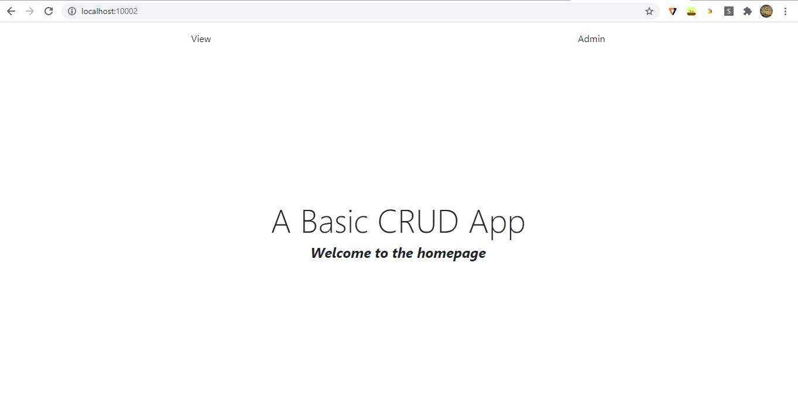
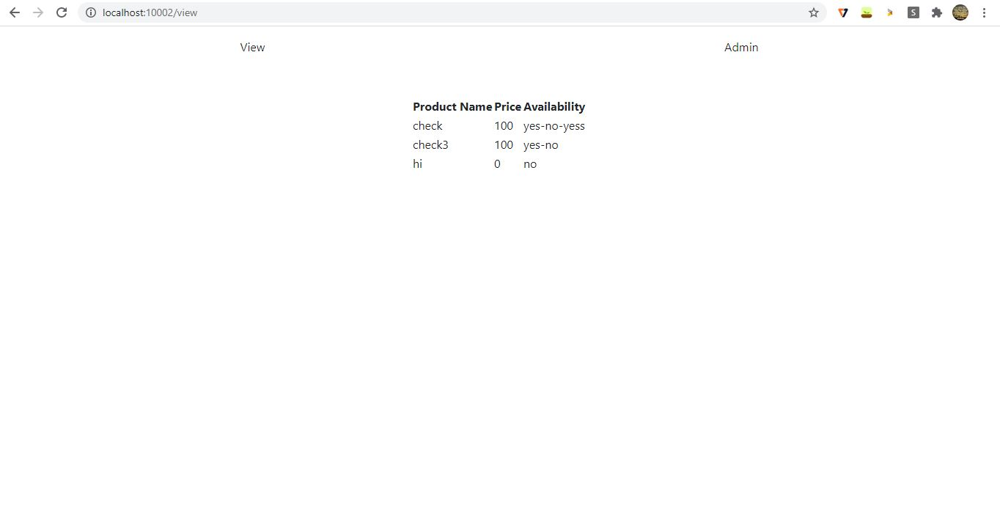

# Golang_PoC - An E-comm Website
### Description
E-comm Website is a basic web application containing all the CRUD actions. The users can view the products present &amp; an authorized user can create,update and delete a product.
#### Technologies :
* Backend : Golang
* Frontend : Vue-js

### Pre-requisties 
* Go initial setup
* Mux package in Go. To download type `go get github.com/gorilla/mux` in cmd

### Folder Structure
The folder structure along with their descriptions is given below.

    ecomm/
     ├── webapp1.go     #main program - contains views for CRUD ops
     ├── data.json      # json file which is used as database 
     └── static/          
           ├── admin.html      
           ├── create.html
           ├── crud.html        
           ├── homepage.html
           ├── update.html
           ├── view.html
           ├── stylesheets/     
                 │       ├── homepage.css     
                 │       ├── view.css
                 │       ├── crud.css     
                 
### Deployment
1. Download this repo in the go root folder
2. Download the required packages
3. Run this in cmd `go run webapp1.go`
4. Go to a brower and type `http//localhost:10002`, the app runs in the local server

### Snapshots 
Homepage

View list of Products

Admin Login

Addition of Product

JSON file before addition 
    

JSON file after addition
    
    
UI after addition

Updation of Product

UI before updation

UI after updation

JSON file after updation

    
   

                
          
